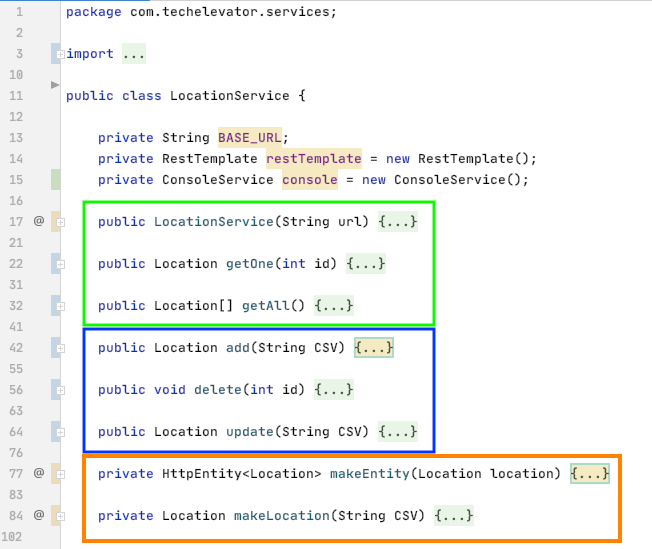
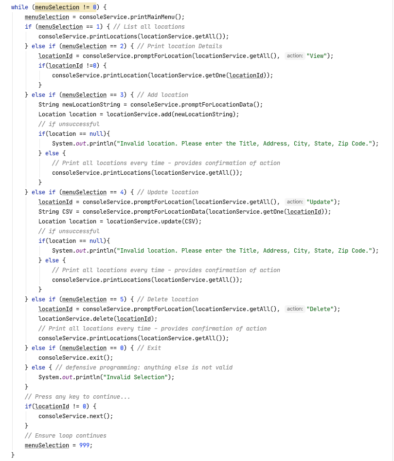

# Web Services POST, PUT, DELETE Tutorial (Java)

In this tutorial, you'll extend the Tech Elevator Locations example from the first day by adding functionality to:

* Add a new Location (`POST`)
* Modify an existing Location (`PUT`)
* Remove a Location (`DELETE`)
* Capture and handle HTTP exceptions

When complete, this produces a full **C**reate **R**ead **U**pdate **D**elete (CRUD) console Web client application.

## Step One: Start the server

Before you start, make sure that the web API is up and running. First, change directories into the `./server/` folder.

Next, run the command `npm install` to install any dependencies. You won't need to do this on any subsequent run.

To start the server, run the command `npm start`. If there aren't any errors, you'll see the following, which means that you've successfully set up your web API:

```
 \{^_^}/ hi!

  Loading data-generation.js
  Done

  Resources
  http://localhost:3000/locations

  Home
  http://localhost:3000

  Type s + enter at any time to create a snapshot of the database
```

You can stop the server, or any other process that you've started from the console, by using the keyboard shortcut `ctrl + c`.

In this tutorial, you'll modify data on the server. As you're working, you may come across a situation where you want to reset the data. To do this, first stop the server with `ctrl + c`, then restart it with `npm start`.

## Step Two: Review the starting code

### Application structure

The `src/main/java/com/` folder:

- techelevator
    - locations
      - App.java `<--main application driver class`
    - models
      - Location.java ` <-- Location Data Model class`
    - services
      - ConsoleService.java ` <-- Console input and output service`
      - LocationService.java ` <-- REST Client and Web API access performed here`

### Provided code versus your code

Everything but the `LocationService` class is provided for you. You'll complete the three methods in the blue box in the image below. The methods in the green box represent the work you previously accomplished. The methods in the orange box are helper methods to assist with making a Web API request.

 

The `main()` method in the App class uses the `ConsoleService` class to prompt and retrieve input from the user and uses the `LocationService` class to request and retrieve the data. This is accomplished through an `if` / `else if` structure shown below.



Now, review the constructor of the `LocationService` class. Note how the code ensures that the URL that is passed in ends with a slash. When you use `BASE_URL`, you won't need to concatenate the `"/"`.

Next, review the `getOne()` and `getAll()` methods. These two methods represent the code you wrote for the HTTP `GET` method. They're invoked by option 1 or option 2 from the main menu.


## Step Three: Add a location with POST

Open the `LocationService.java` file and find the `add()` method.

```java
public Location add(String CSV) {
    // api code here
    return null;
}
```

The code that calls this function passes in a string of comma separated values (CSV).


Those values contain the data that instantiates a `location` object. You'll use the provided helper method named `makeLocation()` for that purpose. Review the code in the `makeLocation()` method.

The CSV string passed in could have five parts if you're modifying an existing location. But if you're adding a location, the `id` field isn't provided. So `makeLocation()` determines how many records exist and creates an `id` that is unique. Then it adds that to the original array of values. Finally, it instantiates a Location object from the provided data.

The first task in the `add()` method is to create a variable that contains a Location object and assigns it a value that's returned from the `makeLocation()` method. Don't forget to pass the CSV string to `makeLocation()`. Add this code as the first line of the `add()` method:

```java
Location location = makeLocation(CSV);
```
If you look at the `makeLocation()` method, you'll notice that it might return `null`. This is the case if a Location object can't be created from the given data. You'll need to deal with this possibility next. Write an `if` statement that returns `null` if the `Location` returned from `makeLocation()` is `null`:

```java
if(location == null) {
    return null;
}
```

Now you've ensured the location is ready to use. Next, you'll use the other helper method named `makeEntity()`. The purpose of this method is to add a header to the POST request. This lets the server know the _Content Type_ contained in the request. Here, the content type is set to `MediaType.APPLICATION_JSON`. Then an `HttpEntity` is created, containing both the new header and the location object.

To use this helper method, you'll need to pass it the location, and assign the return to a new variable of type `HTTPEntity`. Add this as the next line of the `add()` method:

```java
HttpEntity entity = makeEntity(location);
```

Now that you've constructed this `HttpEntity`, you're ready to use `RestTemplate` to `POST` it to the server. To do this, you'll use the `postForObject()` method of RestTemplate. This method accepts an object that's returned from the server.

The `postForObject()` method requires three parameters: a URL, the Entity, and the class used to construct the return object. Use the `BASE_URL` as the URL and `Location.class` as the third parameter. Remember that the URL of the request changes based upon the goal. In this case, the POST request is made to "http://localhost:3000/locations." This is the same URL as a GET request. The difference is the HTTP method being used. Assign the result of this call to the `location` variable. Finally, return `location`:

```java
location = restTemplate.postForObject(BASE_URL, entity, Location.class);
return location;
```

Next, remove the `return null` statement at the end of the method, if still present. You only needed it to satisfy the Java compiler when you first opened the tutorial project.

The `add()` method looks like this:

```java
public Location add(String CSV) {
    Location location = makeLocation(CSV);
    if (location == null) {
        return null;
    }
    HttpEntity entity = makeEntity(location);
    location = restTemplate.postForObject(BASE_URL, entity, Location.class);
    return location;
}
```


## Step Four: Modify a location with PUT

You'll modify the `update()` method next. This method is invoked similarly to the `add()` method. Note that the CSV contains an existing location chosen by the user rather than a brand new location.


This code is similar to the code you added in the `add()` method. In fact, the first five lines are the same. Copy all the lines you placed into the `add()` method up to, but not including, the line with the call to `restTemplate`. Paste that code as the first five lines of `update()` method. The `update()` method looks like this:

```java
public Location update(String CSV) {
    Location location = makeLocation(CSV);
    if(location == null) {
        return null;
    }
}
```

The difference is in the use of `RestTemplate`. To update a record, you'll use the HTTP `PUT` method and append the `id` of the location to update to the URL. Since you have a Location object, you'll use `location.getId()` to retrieve the `id` to append to the URL.

The `RestTemplate.put()` method takes the URL with `id` and the Location object containing the updates. It doesn't return anything, so don't make an assignment statement here. The last statement must return the location object created in the first line. Add this code:

```java
restTemplate.put(BASE_URL + location.getId(), location);
return location;
```

Next, remove the `return null` statement at the end of the method, if still present. You only needed it to satisfy the Java compiler when you first opened the tutorial project.

The complete method looks like this:

```java
public Location update(String CSV) {
    Location location = makeLocation(CSV);
    if(location == null) {
        return null;
    }
    restTemplate.put(BASE_URL + location.getId(), location);
    return location;
}
```
## Step Five: Delete a location with DELETE

To delete a location, you must send the `id` of the location to delete. The `id` is provided when invoked:


Inside the `delete()` method, you'll make one call to `restTemplate.delete()`. This method call takes the URL with the `id` appended to it and returns nothing. This time, the `id` is passed into the `delete` method, and you'll use that with the `BASE_URL`. Add this code to the `delete()` method:

```java
restTemplate.delete(BASE_URL + id);
```
The complete method now looks like this:

```java
public void delete(int id) {
    restTemplate.delete(BASE_URL + id);
}
```

## Step Six: Test your application

Run the application and execute each menu item. If you followed the instructions, the application works as expected. If you encounter any issues, go back and review the previous steps.

From the main menu, select option 4. When prompted for a location id, enter gibberish and observe the result. The program stops because of an error that was returned from the server.


## Step Seven: Add exception handling for HTTP errors

Next you'll capture the errors sent back from the server and prevent the application from crashing. You'll use `try/catch` blocks in this tutorial. Every call to RestTemplate is subject to different exception types that all inherit from `RestClientResponseException`. You'll `catch` that exception and call `console.error()`.

Inside the `catch` block, use the exception methods `getRawStatusCode()` and `getStatusText()` separated by a `" : "` to create an error string. You'll send this error string to the `console.error()` method.

So far the `try/catch` looks like this:

```java
try {
   // to be completed in the next step
} catch (RestClientResponseException ex) {
    console.printError(ex.getRawStatusCode() + " : " + ex.getStatusText());
}
```

Finally, every call to RestTemplate should be surrounded by this `try/catch`. As an example, the complete `add()` method looks like this:

```java
public Location add(String CSV) {
    Location location = makeLocation(CSV);
    if (location == null) {
        return null;
    }
    HttpEntity entity = makeEntity(location);
    try {
        location = restTemplate.postForObject(BASE_URL, entity, Location.class);
    } catch (RestClientResponseException ex) {
        console.printError(ex.getRawStatusCode() + " : " + ex.getStatusText());
    }
    return location;
}
```

> Only the call to RestTemplate needs to go inside the `try` block.

Once again, enter gibberish for menu option 4. You should see the error message in the console. The application continues to run.


## Summary

In this tutorial, you learned how to:

* Use the HTTP `POST` Web API call to add a new Location
* Use the HTTP `PUT` Web API call to modify a new Location
* Use the HTTP `DELETE` Web API call to delete a new Location
* Use Exception handling for HTTP errors
